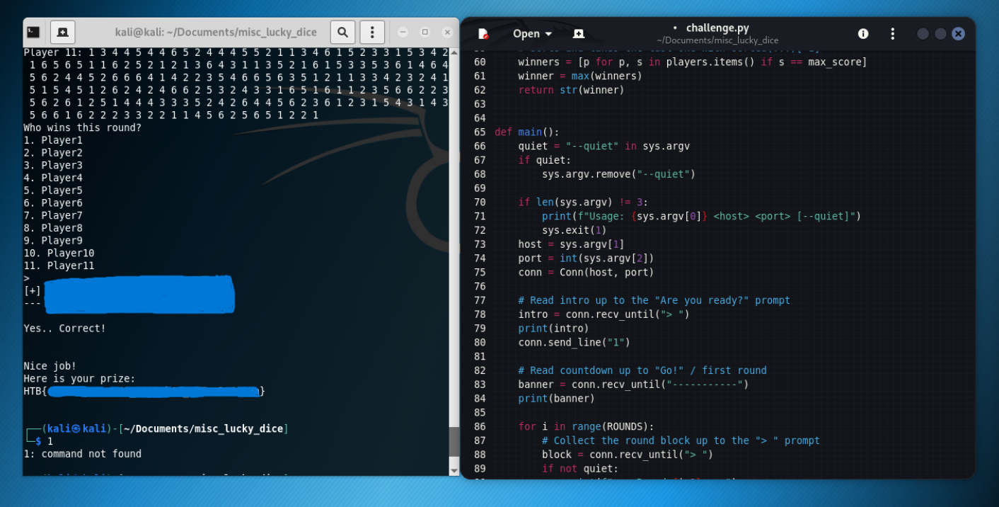

# Lucky Dice Challenge 


## Overview

Connecting to the challenge starts a dice game. Several players roll dice each round, and you have to say who won. The problem is you need 100 rounds right in a row, with barely any time to answer each one. That's obviously not something you can do by hand, so the point of the challenge is to automate a bot.

## Approach

The server's source code is readable, so it was easy to see how each round gets decided. Players' scores are just the sum of their dice, and whoever has the highest total wins. If there's a tie, the winner is the last player with that score, not the first one.

My first version used `max()` on the scores dictionary, which picks the first tied player instead of the last one. That caused random failures whenever two players tied for the top score. Fixing the tiebreak to grab the last matching player solved it.

## Solution

The bot connects over a socket, reads each round, adds up the dice for every player, works out the winner using the correct tiebreak rule, and sends the answer back. It repeats this for all 100 rounds until the server hands over the flag.

```bash
python3 solve.py <IP> <PORT> --quiet
```

## Result

```
Nice job!
Here is your prize:
HTB{flag_here}
```

<div align="center">
</div>

</p>

## Takeaway

The dice math was never the hard part. The real challenge was reading the source closely enough to catch that tiebreak rule, since getting it wrong looked like random bad luck instead of an actual bug.
