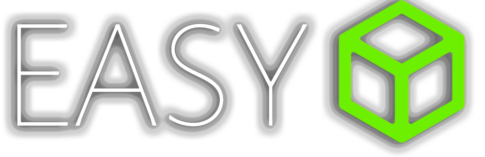
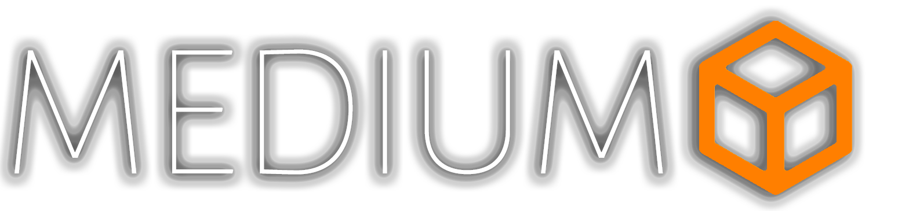
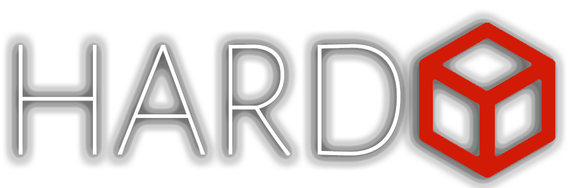
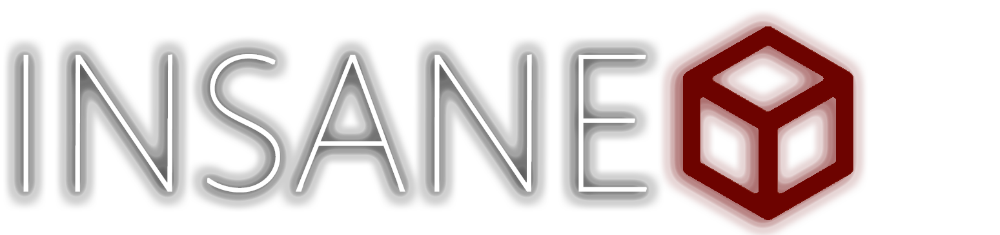

### This is a repository where I'll put information about each machine I finish, including the resources I used and other details. When the machines are retired, I'll create write-up for them.

### Next, I will list the difficulties, and after that, the reviews of each machine.
## Machines

### - [Expressway (Linux) (10.10.11.87)](Machines/Expressway/)
### - [Editor (Linux) (10.10.11.80)](Machines/Editor/)
### - [Cap (Linux) (10.10.10.245)](Machines/Cap/)
### - [Eighteen (Windows) (10.10.11.95)](Machines/Eighteen/)
### - [Monitors Four (Windows) (10.10.11.99)](Machines/Monitors%20Four/)
### - [Reactor (Linux) (10.129.245.214)](Machines/Reactor/)

##

### - [Strutted (Linux) (10.10.11.59)](Machines/Strutted/)

### - [Previous (Linux) (10.10.11.83)](Machines/Previous/)
### - [Gavel (Linux) (10.10.11.97)](Machines/Gavel/)

##

### Any machine yet.

##

### - [White Rabbit (Linux) (10.10.11.63)](Machines/White%20Rabbit/)

## Challenges

### - [AHS512](Challenges/AHS512/)
### - [Artifact Of Dangerous Sighting](Challenges/Artifact%20Of%20Dangerous%20Sighting/)
### - [Keep Tryin'](Challenges/Keep%20Tryin'/)
### - [Lucky Dice](Challenges/Lucky%20Dice'/)
### - [Interestellar C2](Challenges/Interstellar%20C2'/)
